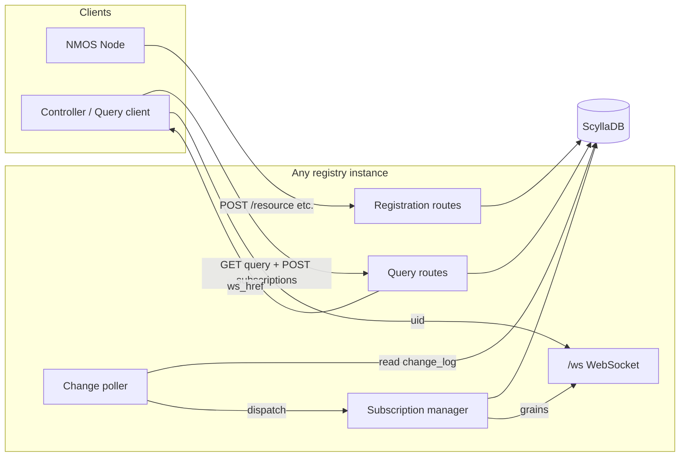

# nmos-scripty-registry

[](https://github.com/cristian-recoseanu/nmos-scripty-registry/actions/workflows/unit_tests.yml)
[](https://github.com/cristian-recoseanu/nmos-scripty-registry/actions/workflows/nmos_api_tests.yml)

An [NMOS IS-04](https://specs.amwa.tv/is-04/) registry: **Registration API** and **Query API**. Persistence targets **[ScyllaDB](https://www.scylladb.com/)** via the Cassandra protocol (`cassandra-driver`).  
mDNS is out of scope for this codebase.

For DNS-SD follow the guide available in [AMWA INFO-004](https://specs.amwa.tv/info-004/) in order to set up the correct entries in your preferred DNS server.

---

## Architectural decisions

### Shared cluster state (high availability)

Multiple registry **processes** can run behind a load balancer. They do **not** share memory; they share **one Scylla keyspace**. Any instance can serve Registration or Query HTTP traffic; all instances observe the same data after Scylla replicates writes.

This matches IS-04’s guidance that several Registration or Query API instances may sit in front of a **common registry** ([Load balancing & redundancy](https://specs.amwa.tv/is-04/releases/v1.3.3/docs/APIs_-_Load_Balancing_&_Redundancy.html)).

### API stack

- **Fastify** for HTTP performance and clear plugin boundaries.
- **`@fastify/websocket`** for subscription transports.
- **TypeScript**, **ESM**, **Node 22+**.

---

## Major building blocks



---

## Build and run

### Prerequisites

- **Node.js 22+**
- **ScyllaDB** (or Cassandra) reachable on the CQL port (default **9042**)

### Install and compile

```bash
npm install
npm run build
```

Artifacts go to `dist/`. Run compiled output with:

```bash
npm start
```

### Development (TypeScript directly)

```bash
npm run dev
```

### Linter checks

```bash
npm run lint
```

### Tests

```bash
npm test
```

[Vitest](https://vitest.dev/) runs all `src/**/*.test.ts` files.

```bash
npm run test:watch
```

keeps Vitest in watch mode during development.

### Run using Docker

The repo includes a minimal Compose file:

```bash
EXTERNAL_HOST=YOUR_EXTERNAL_IP docker compose up -d --build
```

or you run the one with the load balancer

```bash
EXTERNAL_HOST=192.100.200.1 LB_PORT=8082 HEARTBEAT_GC_INTERVAL_SECONDS=12 docker compose -f docker-compose-cluster.yml up --build
```

and shutdown
```bash
docker compose -f docker-compose-cluster.yml down --timeout 90 --remove-orphans
```

Wait until Scylla accepts CQL on `9042`, then start the registry.

### Environment variables

| Variable                        | Default                   | Purpose                                                                                                                                                                                                       |
| ------------------------------- | ------------------------- | ------------------------------------------------------------------------------------------------------------------------------------------------------------------------------------------------------------- |
| `HOST`                          | `0.0.0.0`                 | HTTP listen address                                                                                                                                                                                           |
| `PORT`                          | `8080`                    | HTTP listen port                                                                                                                                                                                              |
| `NMOS_API_VERSIONS`             | `v1.2,v1.3`               | Comma-separated path versions (e.g. `v1.2,1.3`). Each value is normalised (`normalizeApiPathVersion` in `config.ts`), deduped, sorted, and mounted as `/x-nmos/registration/<v>/…` and `/x-nmos/query/<v>/…`. |
| `PUBLIC_HTTP_BASE`              | `http://127.0.0.1:{PORT}` | Public HTTP URL for your deployment (loaded into config; use your LB URL in HA setups)                                                                                                                        |
| `PUBLIC_WS_BASE`                | `ws://127.0.0.1:{PORT}`   | Base used when building subscription `ws_href` (set to `wss://…` behind TLS termination)                                                                                                                      |
| `QUERY_API_SOURCE_ID`           | _(see `config.ts`)_       | UUID for `source_id` in WebSocket grains                                                                                                                                                                      |
| `SCYLLA_CONTACT_POINTS`         | `127.0.0.1`               | Comma-separated CQL hosts                                                                                                                                                                                     |
| `SCYLLA_LOCAL_DC`               | `datacenter1`             | Local datacenter name (must match cluster topology)                                                                                                                                                           |
| `SCYLLA_KEYSPACE`               | `nmos_registry`           | Keyspace name                                                                                                                                                                                                 |
| `SCYLLA_REPLICATION_FACTOR`     | `1`                       | Per-datacenter RF for `NetworkTopologyStrategy`                                                                                                                                                               |
| `CHANGE_POLL_MS`                | `200`                     | How often each instance polls `change_log`                                                                                                                                                                    |
| `CHANGE_LOG_TTL_SECONDS`        | `604800` (7d)             | TTL applied to `change_log` rows                                                                                                                                                                              |
| `PERSISTED_SUBSCRIPTION_TTL_SECONDS` | `86400` (24h)        | TTL for `persisted_subscriptions` rows (refreshed periodically while sockets are connected)                                                                                                                 |
| `HEARTBEAT_GC_INTERVAL_SECONDS` | `12`                      | Heartbeat garbage collection interval (IS-04 default)                                                                                                                                                         |
| `LOG_LEVEL`                      | `info`                    | Logging level (e.g., `info`, `debug`, `warn`, `error`)                                                                                                                                                        |
